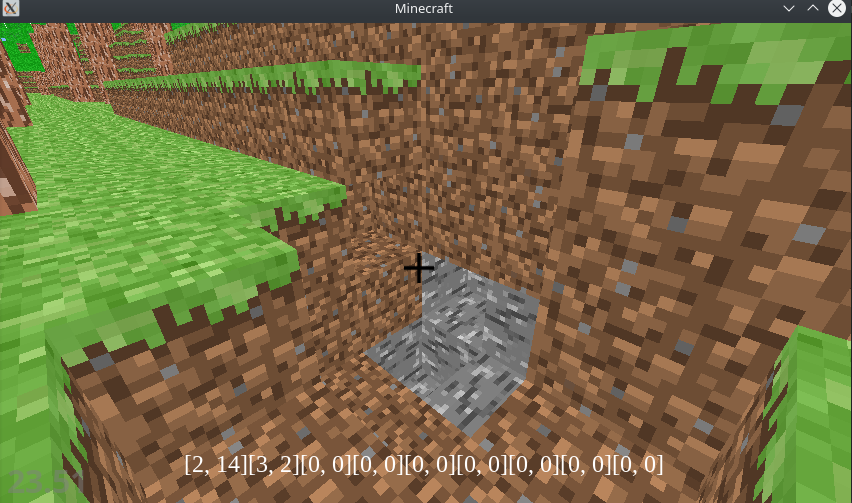
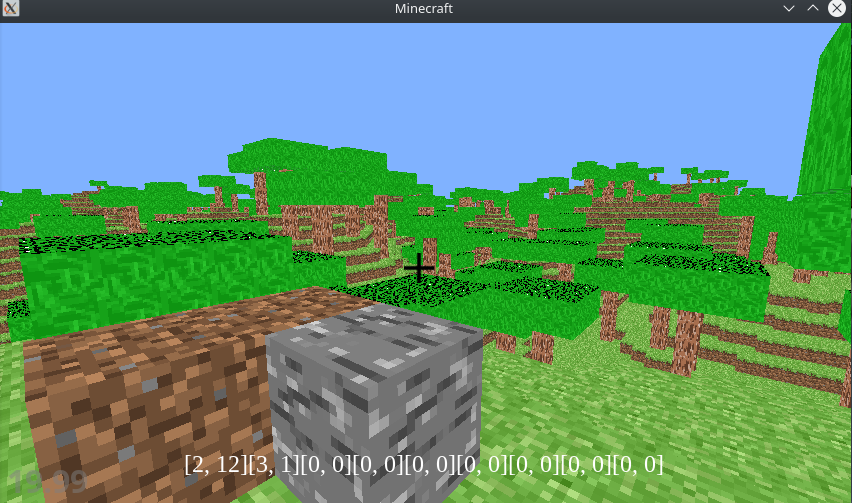

## Requirements

* python 3.8
* pyglet 1.5
* noise 1.2
* pyYAML 5.3.1
* numpy 1.19.2

## Setup

In order to run the game, go to the main directory and run command:
```
$ PYTHONPATH=`pwd` python3 game_files/Setup.py 
```


## Game



